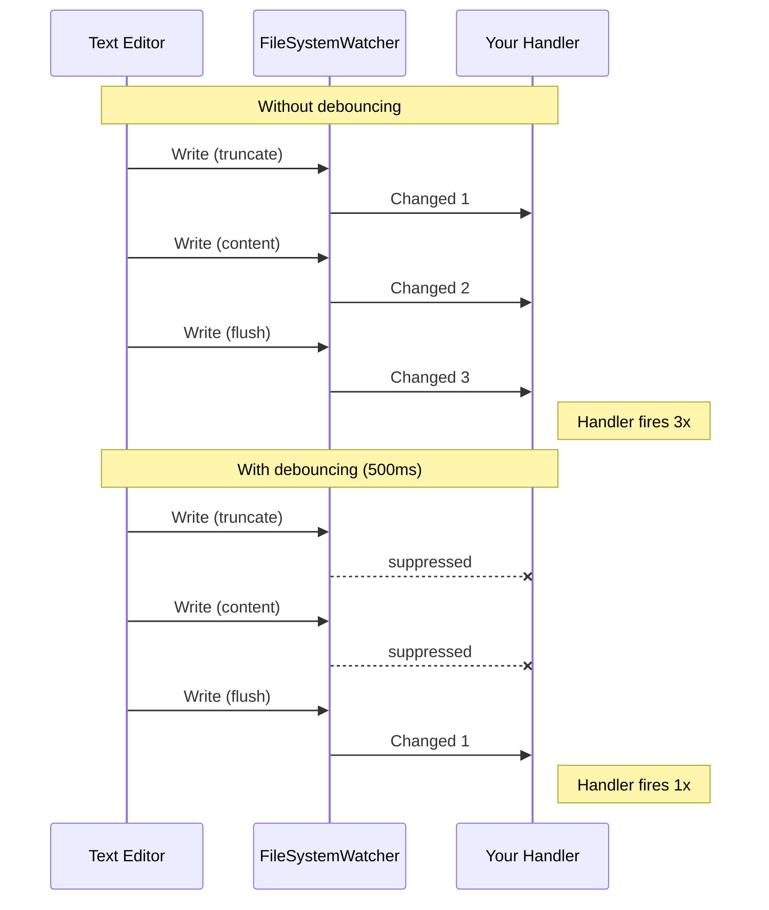

# Debouncing

Reduce noise from rapid file changes with built-in debouncing.

## The Problem

When a file is saved, `FileSystemWatcher` often reports multiple events in quick succession (e.g., a text editor might write, truncate, then write again). Without debouncing, your handler fires multiple times for what is essentially one logical change.



## Configuration

```csharp
// Milliseconds
var monitor = ResilientFileSystemMonitor
    .Watch(@"C:\configs", "*.json")
    .WithDebounce(500)
    .OnChanged((s, e) => Reload(e.FullPath))
    .Build();

// TimeSpan
var monitor = ResilientFileSystemMonitor
    .Watch(@"C:\configs", "*.json")
    .WithDebounce(TimeSpan.FromMilliseconds(500))
    .OnChanged((s, e) => Reload(e.FullPath))
    .Build();
```

## How It Works

When debouncing is enabled:

1. First event for a file is recorded with a timestamp
2. Subsequent events for the **same file** within the debounce window are silently dropped
3. After the debounce window expires, the next event for that file is allowed through

This is a **per-file** debounce — events for different files don't affect each other.

## When to Use

| Scenario | Recommended Debounce |
|----------|---------------------|
| Config file reloading | 300 - 500 ms |
| Certificate rotation | 1000 - 2000 ms |
| Log file monitoring | Usually not needed |
| Source code hot-reload | 200 - 500 ms |

## Without Debouncing

If you don't configure debouncing, all events are delivered as-is. You can implement your own throttling using the `ChannelReader`:

```csharp
var lastProcessed = new Dictionary<string, DateTime>();
var throttle = TimeSpan.FromMilliseconds(500);

await foreach (var evt in monitor.Events.ReadAllAsync())
{
    if (evt.Kind == FileSystemEventKind.Changed)
    {
        var now = DateTime.UtcNow;
        if (!lastProcessed.TryGetValue(evt.FullPath, out var last)
            || now - last > throttle)
        {
            lastProcessed[evt.FullPath] = now;
            await ProcessAsync(evt.FullPath);
        }
    }
}
```

Or use Rx.NET for advanced throttling — see [Rx.NET Integration](/guide/reactive/rxnet).
