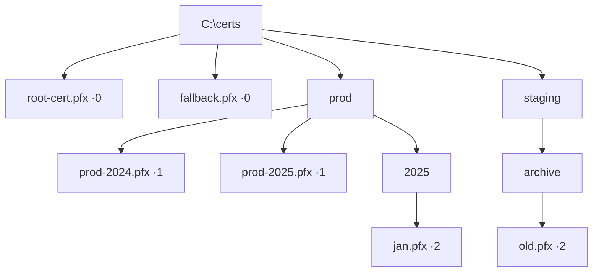

# Subdirectory Depth Control

Control how deeply `ResilientFileSystemMonitor` monitors subdirectories.

## Default: Non-Recursive

By default, only the root directory is monitored:

```csharp
var monitor = ResilientFileSystemMonitor
    .Watch(@"C:\certs", "*.pfx")
    .Build();

// Only monitors: C:\certs\*.pfx
// Ignores: C:\certs\prod\*.pfx
```

## Depth Values

| Value | Meaning | Example |
|-------|---------|---------|
| `0` | Root only (default) | `C:\certs\*.pfx` |
| `1` | Direct children | `C:\certs\prod\*.pfx` |
| `2` | Two levels deep | `C:\certs\prod\2025\*.pfx` |
| `-1` | Unlimited | All subdirectories |

## Configuration

```csharp
// Unlimited depth
.IncludeSubdirectories()        // parameterless = unlimited
.IncludeSubdirectories(true)    // explicit boolean
.IncludeSubdirectories(-1)      // explicit unlimited

// Specific depth
.IncludeSubdirectories(1)       // direct children only
.IncludeSubdirectories(2)       // children and grandchildren

// Disable (same as default)
.IncludeSubdirectories(false)   // explicit off
.IncludeSubdirectories(0)       // explicit root only
```

## Visual Example



| Depth | Files monitored |
|-------|----------------|
| **0** (default) | `root-cert.pfx`, `fallback.pfx` |
| **1** | above + `prod-2024.pfx`, `prod-2025.pfx` |
| **2** | above + `jan.pfx`, `old.pfx` |

## Performance

Depth filtering is implemented in managed code. The underlying `FileSystemWatcher` always receives events from all subdirectories (it only supports boolean on/off). Cocoar calculates the relative path depth and silently drops events that exceed the limit.

**Overhead is minimal** — just string parsing and counting path separators.

::: tip
Use depth limits to avoid processing events from `node_modules`, `.git`, `bin`, `obj`, and other deep dependency trees.
:::

## Validation

Invalid depth values throw `ArgumentException`:

```csharp
// Valid
.IncludeSubdirectories(-1)  // unlimited
.IncludeSubdirectories(0)   // root only
.IncludeSubdirectories(99)  // specific depth

// Invalid — throws ArgumentException
.IncludeSubdirectories(-2)
.IncludeSubdirectories(-10)
```

## Use Cases

### Certificate Management

```csharp
// Monitor certs in prod/staging/dev folders, not deeper
.Watch(@"C:\certs", "*.pfx")
.IncludeSubdirectories(1)
```

### Source Code Monitoring

```csharp
// Reasonable depth to avoid bin/obj/packages
.Watch(@"C:\src", "*.cs")
.IncludeSubdirectories(4)
```

### Log Monitoring

```csharp
// Only root log directory, ignore archived logs in subfolders
.Watch(@"C:\logs", "*.log")
// No .IncludeSubdirectories() — default depth 0
```
