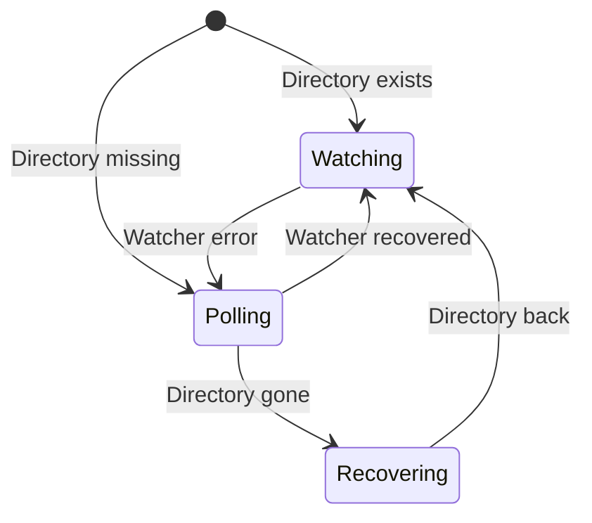

# ResilientFileSystemMonitor Overview

The `ResilientFileSystemMonitor` is the core of Cocoar.FileSystem. It wraps .NET's `FileSystemWatcher` in a resilient layer with automatic fallback, error recovery, and lossless event delivery.

## How It Works

1. **Startup**: Attempts to create a native `FileSystemWatcher`. If the directory doesn't exist, starts in polling mode.
2. **Monitoring**: Events flow through a `Channel<T>` for sequential, ordered delivery.
3. **Health checks**: A 1-second timer verifies the directory still exists and hasn't been recreated (identity tracking).
4. **Audit**: A 60-second timer computes a SHA256 fingerprint of all file metadata to detect silent event loss.
5. **Recovery**: If the watcher fails, falls back to polling. When conditions improve, switches back to native.

## State Machine



## Two Ways to Create

### Fluent Builder (Recommended)

```csharp
var monitor = ResilientFileSystemMonitor
    .Watch(@"C:\configs", "*.json")
    .WithDebounce(500)
    .IncludeSubdirectories(2)
    .OnChanged((s, e) => Reload(e.FullPath))
    .Build();
```

### Options Pattern

```csharp
var monitor = new ResilientFileSystemMonitor(
    new ResilientFileSystemMonitor.Options
    {
        Path = @"C:\configs",
        Filter = "*.json",
        DebounceTime = TimeSpan.FromMilliseconds(500),
        MaxDepth = 2,
    });

monitor.Changed += (s, e) => Reload(e.FullPath);
```

## Two Ways to Consume Events

### Traditional Events

```csharp
monitor.Created += (s, e) => Console.WriteLine($"Created: {e.Name}");
monitor.Changed += (s, e) => Console.WriteLine($"Changed: {e.Name}");
monitor.Deleted += (s, e) => Console.WriteLine($"Deleted: {e.Name}");
monitor.Renamed += (s, e) => Console.WriteLine($"Renamed: {e.OldName} -> {e.Name}");
monitor.Error   += (s, e) => Console.WriteLine($"Error: {e.GetException().Message}");
```

### ChannelReader Stream

```csharp
await foreach (var evt in monitor.Events.ReadAllAsync())
{
    switch (evt.Kind)
    {
        case FileSystemEventKind.Created: // ...
        case FileSystemEventKind.Changed: // ...
        case FileSystemEventKind.Deleted: // ...
        case FileSystemEventKind.Renamed: // ...
    }
}
```

The channel approach gives you a unified, ordered stream of all events. See [Events & Channels](/guide/monitor/events-channels) for details.

## Disposal

Always dispose when done:

```csharp
using var monitor = ResilientFileSystemMonitor
    .Watch(@"C:\data")
    .Build();
// Automatically disposed at end of scope
```

## Key Properties

| Property | Type | Description |
|----------|------|-------------|
| `Events` | `ChannelReader<FileSystemEvent>` | Unified event stream |
| `IsUsingWatcher` | `bool` | `true` if using native FileSystemWatcher |

## Platform Support

| Platform | Native Backend | Identity Tracking |
|----------|---------------|-------------------|
| Windows | `ReadDirectoryChangesW` | `CreateFileW` + `GetFileInformationByHandle` |
| Linux | `inotify` | `stat()` inode |
| macOS | `FSEvents` | `stat()` inode |
