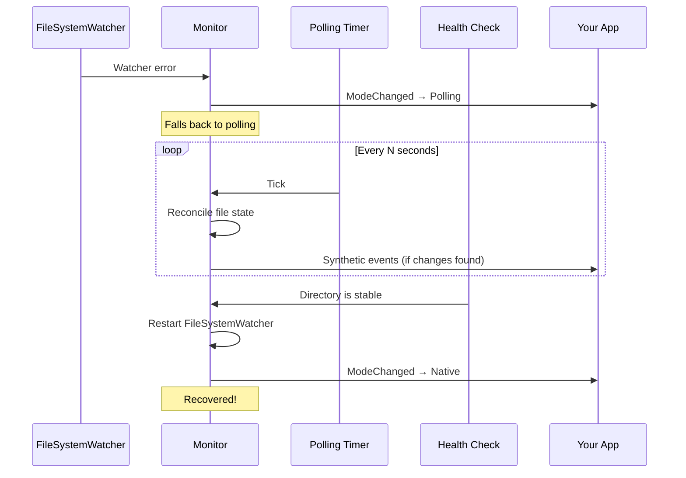

# Polling Fallback

When the native `FileSystemWatcher` fails, `ResilientFileSystemMonitor` automatically switches to polling mode. When conditions improve, it switches back.

## When Does Fallback Occur?

- Directory doesn't exist at startup
- `FileSystemWatcher` throws an error
- Directory is deleted while being monitored
- Network share disconnects
- Permission errors on the watched directory

## How Polling Works

In polling mode, the monitor periodically:

1. Checks if the directory exists (health check)
2. Takes a snapshot of all files (metadata: size, last write time, attributes)
3. Compares against the previous snapshot (reconciliation)
4. Emits synthetic Created, Changed, or Deleted events for any differences
5. Attempts to restart the native watcher

## Configuration

```csharp
// Custom polling interval (default: 5 seconds)
.WithPollingFallback(TimeSpan.FromSeconds(10))

// Milliseconds shorthand
.WithPollingFallback(3000)

// Disable polling fallback entirely
.WithoutPollingFallback()
```

::: warning
Disabling polling fallback means the monitor will stop working if the native watcher fails. Only do this if you're certain the watched directory will always be stable.
:::

## Observing Mode Changes

```csharp
var monitor = ResilientFileSystemMonitor
    .Watch(@"C:\data")
    .OnModeChanged((s, e) =>
    {
        _logger.LogInformation("Monitor mode: {Mode} - {Reason}", e.Mode, e.Reason);
    })
    .Build();

// Check current mode
if (monitor.IsUsingWatcher)
    Console.WriteLine("Using native FileSystemWatcher");
else
    Console.WriteLine("Using polling fallback");
```

## Recovery Flow



## Timers

| Timer | Default | Purpose |
|-------|---------|---------|
| Health check | 1 second | Detects directory disappearance (cheap: `Directory.Exists`) |
| Audit | 60 seconds | Detects silent event loss via SHA256 metadata fingerprinting |
| Polling | 5 seconds | Full reconciliation when in polling mode |

```csharp
.WithHealthCheckInterval(TimeSpan.FromSeconds(2))
.WithAuditInterval(TimeSpan.FromMinutes(5))
.WithPollingFallback(TimeSpan.FromSeconds(10))
```

## Docker Volume Example

A common scenario: container starts before the volume is mounted.

```csharp
var monitor = ResilientFileSystemMonitor
    .Watch("/app/data", "*.dat")
    .WithPollingFallback(TimeSpan.FromSeconds(5))
    .OnModeChanged((s, e) =>
    {
        if (e.Mode == WatcherMode.Native)
            _logger.LogInformation("Volume mounted, switched to native watcher");
    })
    .OnCreated((s, e) => ProcessFile(e.FullPath))
    .Build();

// 1. Starts in polling mode (directory doesn't exist)
// 2. Volume gets mounted
// 3. Health check detects directory, switches to native
// 4. ModeChanged event fires
```
