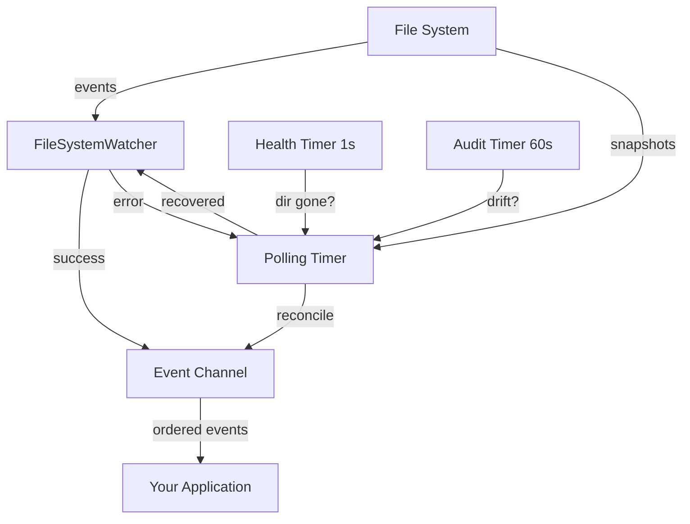

# Why Cocoar.FileSystem?

.NET's built-in `FileSystemWatcher` is notoriously unreliable in production environments. Cocoar.FileSystem wraps it in a resilient layer that handles the failure modes you'll inevitably encounter.

## Problems with Raw FileSystemWatcher

| Problem | FileSystemWatcher | Cocoar.FileSystem |
|---------|-------------------|-------------------|
| Directory doesn't exist at startup | Throws exception | Polls until directory appears |
| Directory deleted and recreated | Silent failure, stops working | Detects via identity tracking, re-initializes |
| Watcher crashes on error | Dead, no recovery | Falls back to polling, recovers to native |
| Docker volume not yet mounted | Throws exception | Polls until mounted, then switches to native |
| Network share disconnects | Dead, no recovery | Falls back to polling, reconnects |
| Events lost silently | No detection | Audit timer detects divergence, reconciles |
| Rapid duplicate events | Manual throttling needed | Built-in debouncing |
| macOS `FSEvents` quirks | Must handle manually | Handled transparently |

## Real-World Scenarios

### Certificate Rotation in Kubernetes

In Kubernetes, certificate files are often mounted as volumes that get atomically swapped. The directory inode changes, which kills a raw `FileSystemWatcher` silently.

```csharp
// Raw FileSystemWatcher: silently stops working after swap
// Cocoar: detects identity change, re-initializes
var monitor = ResilientFileSystemMonitor
    .Watch("/certs")
    .WithFilter("*.pfx", "*.p12", "*.cer")
    .IncludeSubdirectories(1)
    .OnChanged((s, e) => ReloadCertificates())
    .Build();
```

### Docker Volume Mounting

Containers often start before volumes are mounted. A raw watcher throws on startup. Cocoar waits patiently.

```csharp
// Starts in polling mode, switches to native when volume appears
var monitor = ResilientFileSystemMonitor
    .Watch("/app/data", "*.dat")
    .WithPollingFallback(5000)
    .OnCreated((s, e) => ProcessFile(e.FullPath))
    .Build();
```

### Network Share Monitoring

Network shares disconnect unpredictably. Cocoar handles the error and recovers when connectivity returns.

```csharp
var monitor = ResilientFileSystemMonitor
    .Watch(@"\\server\share\configs", "*.json")
    .WithPollingFallback(TimeSpan.FromSeconds(15))
    .OnModeChanged((s, e) =>
        _logger.LogInformation("Monitor: {Mode} - {Reason}", e.Mode, e.Reason))
    .Build();
```

## Architecture at a Glance



## Zero Dependencies

Cocoar.FileSystem uses only .NET BCL APIs:

- `System.IO.FileSystemWatcher` for native monitoring
- `System.Threading.Channels` for event serialization
- `System.IO.Enumeration.FileSystemEnumerable` for lazy search
- `System.Runtime.InteropServices` for platform-specific identity tracking
- `System.Security.Cryptography` for audit fingerprinting

No NuGet packages. No transitive dependencies. Just .NET.
